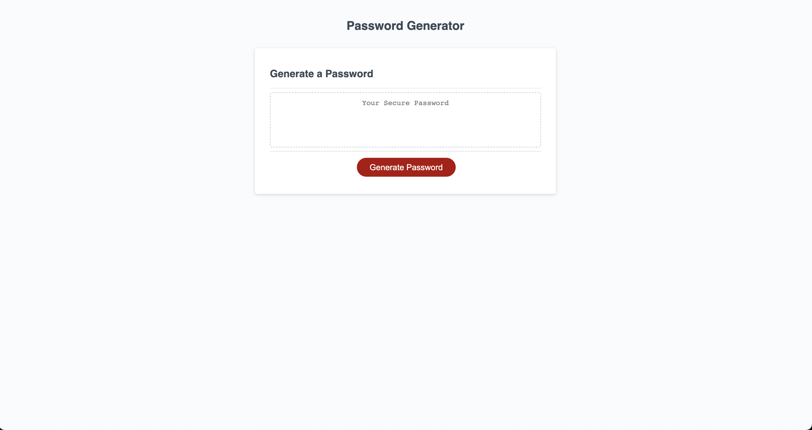
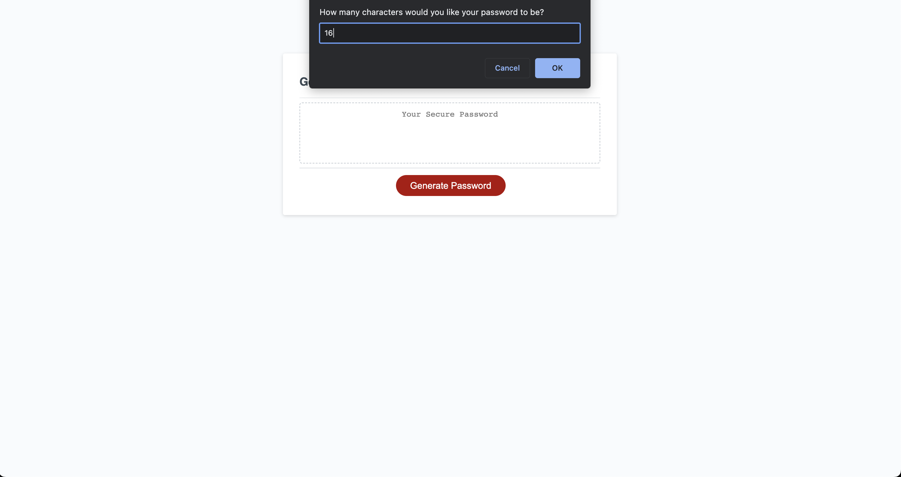
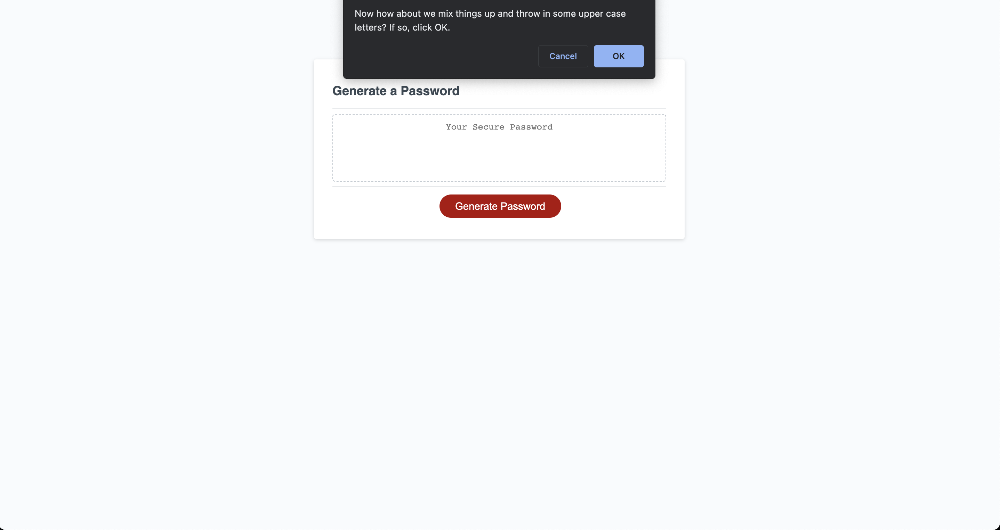

# Password Generator
This is a web-based application that generates a random password based on user-selected criteria.

## Table of Contents

- [Installation](#installation)
- [Usage](#usage)
- [Credits](#credits)
- [License](#license)

## Installation

There is no installation required to use the generator. Just simply click on the link to get started. 

## Usage

To use the password generator, simply click the "Generate Password" button. You will then be prompted with an alert asking you to select the length of the password and which types of characters you would like to include. Once you made your selection, your randomly generated password will display on the screen.

## Credits

n/a

## License

This project is licensed under the terms of the [CC0 1.0 Universal](https://creativecommons.org/publicdomain/zero/1.0/legalcode)
